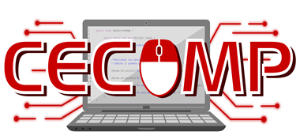

<p align="center">
  
</p>

<h1 align="center">Sistema de Gestión y Reasignación de Grupos UNS</h1>

<p align="center">
  <strong>Producto de Software desarrollado para el curso de PHP + Laravel</strong><br>
  <strong>CECOMP UNS — Centro de Cómputo de la Universidad Nacional del Santa</strong>
</p>

<p align="center">
  
  
  
  
  
</p>

---

## 🎓 Información Académica

* **Institución:** Universidad Nacional del Santa (UNS) — Chimbote, Perú
* **Centro:** Centro de Cómputo (CECOMP UNS)
* **Curso:** Desarrollo Web con PHP y Laravel
* **Docente a Cargo:** Ing. Whiston Borja Reyna
* **Tech Lead del Proyecto:** Angel Rojas

---

## 📌 Problemática y Contexto del Proyecto

Durante el proceso de matrícula oficial en la Universidad Nacional del Santa (UNS), los estudiantes se inscriben inicialmente en una única teoría (**Teoría 1**) y en distintos grupos de práctica (**P1A, P1B, P1C, P1D**, etc.).

Posteriormente, debido a la saturación de alumnos ($N \ge 60$) o a la reprogramación de horarios de laboratorio, la universidad autoriza la apertura de una **Teoría 2** y la reestructuración de los grupos de práctica. Esta tarea recae tradicionalmente en el **Delegado del curso**, quien debe reorganizar a los estudiantes de forma transparente, equitativa y con trazabilidad ante las autoridades académicas y docentes.

Este sistema web automatiza la reestructuración inicial y proporciona al delegado herramientas analíticas y de control fino para gestionar casos particulares, cruces de horarios y la emisión de actas oficiales.

---

## 🚀 Principales Módulos y Funcionalidades Desarrolladas

1. **Dashboard Analítico e Inteligencia Académica (`/dashboard`):**
   * Gráficos interactivos construidos con **Chart.js**.
   * Monitoreo de aforo y ocupación de laboratorios vs capacidad base (15 cupos).
   * Índice de equipamiento tecnológico (estudiantes con laptop propia).
   * Verificación de cumplimiento de carga lectiva docente (máx. 1 teoría por docente en un ciclo).
   * Distribución de demanda por ciclos académicos (II, IV, VI y VIII Ciclo).
   * Gráfico circular de promociones de ingreso por asignatura (**Promo Regular** vs. **Repitentes**).

2. **Simulador Previo de División (*Dry Run / Modo Preview*):**
   * Vista previa interactiva con partición matemática truncada $\lfloor N/2 \rfloor$ antes de alterar la base de datos.
   * Acordeón desplegable con el padrón nominal de estudiantes que migrarían a Teoría 2.
   * Confirmación atómica con registro de `batch_id` para posibilitar reversiones.

3. **Módulo Padrón General de Estudiantes (`/students`):**
   * Buscador en tiempo real por nombre, código de matrícula institucional (10 dígitos) o correo.
   * Filtros dinámicos por roles (*Estudiantes Regulares*, *Delegados Oficiales*).
   * Gestión y edición de datos del estudiante y asignación de delegados.

4. **Gestión de Cursos y Plana Docente (`/courses`, `/teachers`):**
   * Catálogo con filtros dinámicos por ciclo académico (II, IV, VI y VIII Ciclo).
   * Regla institucional UNS: control de teorías simultáneas y asignación de carga de prácticas.

5. **Auditoría Inmutable y Rollback (`/audit`):**
   * Bitácora criptográfica con estados `previous_state` y `new_state` en JSON.
   * Capacidad de revertir operaciones individuales o masivas (*Rollback* seguro).

6. **Exportaciones Oficiales:**
   * Padrón general y por curso en **Excel** (`.xlsx`) delimitado por teorías y turnos.
   * Actas de asistencia para firma docente en formato **PDF** con membrete oficial UNS.

7. **Generador de Datos Ficticios Anonimizados (`php artisan uns:seed-demo`):**
   * 26 asignaturas de la malla, 20 docentes, 280 alumnos ficticios y 1,407 matrículas listas para exponer protegiendo datos personales (Ley N° 29733).

---

## 👥 Equipo de Desarrollo y Funcionalidades Asignadas

El proyecto fue desarrollado de forma colaborativa por un equipo de 8 integrantes, aplicando la metodología GitFlow:

| N° | Integrante | Rol | Rama Git | Funcionalidad y Entregables |
|:---:|:---|:---|:---|:---|
| **1** | **Angel Rojas** | **Tech Lead & Algoritmo** | `feature/reallocation-service` | Arquitectura de servicios, algoritmo de partición truncada $\lfloor N/2 \rfloor$, Simulador Previo (*Dry Run*), Dashboard analítico con Chart.js, optimización de modales y suite de pruebas. |
| **2** | **Walter Flores** | **Líder de Base de Datos** | `feature/database-migrations` | Modelado relacional, diseño de llaves foráneas, índices de rendimiento y migraciones Eloquent. |
| **3** | **Loeffer** | **Asistente de Datos** | *Dataset / Seeds* | Modelado del dataset institucional con códigos oficiales UNS de 10 dígitos y distribución de turnos. |
| **4** | **Diego Gutierrez** | **Líder de FrontEnd & UI** | `feature/frontend-ui` | Layout institucional responsivo en Blade con Tailwind CSS, Alpine.js, modales y toggles AJAX. |
| **5** | **Joshua Norabuena** | **Panel del Delegado y Filtros** | `feature/delegate-panel-filters` | Filtros por código/nombre, turno, orden FIFO/alfabético, paginación y tarjetas de prácticas. |
| **6** | **Kelvin Carrillo** | **Auditoría y Rollback** | `feature/audit-and-rollback` | Módulo de auditoría inmutable (`AuditService`), tracking con `batch_id` y reversión transaccional (*Rollback*). |
| **7** | **Yampier Salinas** | **Exportación Oficial** | `feature/pdf-excel-exports` | Reportes en Excel (`maatwebsite/excel`) y actas oficiales en PDF (`barryvdh/laravel-dompdf`). |
| **8** | **Jared Rosales** | **Módulo de Estudiantes** | `feature/students-crud` | Módulo para edición de datos del estudiante, roles institucionales y visualización de materias inscritas. |

---

## ⚙️ Reglas de Negocio Institucionales (UNS)

1. **Condición de Apertura de Teoría 2:**
   * La división se activa únicamente cuando los matriculados son **mayor o igual a 60** ($N \ge 60$).
2. **Partición Truncada de Prácticas:**
   $$\text{Grupos para Teoría 2} = \lfloor N / 2 \rfloor, \quad \text{Grupos para Teoría 1} = N - \lfloor N / 2 \rfloor$$
   * El conteo del abecedario se reinicia en `A` para Teoría 2 (`P2A, P2B...`).
3. **Capacidad y Aforo de Laboratorios:**
   * Aforo base por laboratorio: **15 alumnos**.
4. **Regla de Carga Lectiva Docente:**
   * Un docente no puede dictar más de 1 teoría en un mismo ciclo, pero puede dictar múltiples prácticas.
5. **Trazabilidad e Inmutabilidad:**
   * Cada movimiento (automático o manual) genera un registro inmutable en `audit_logs`.

---

## 🛠️ Stack Tecnológico

* **Lenguaje:** PHP 8.2+
* **Framework:** Laravel 12.x
* **Base de Datos:** MySQL 8.0+ / SQLite (en memoria para testing)
* **Frontend:** Blade, Tailwind CSS, Alpine.js, Phosphor Icons
* **Gráficos:** Chart.js
* **Testing:** PHPUnit 11.x (40 tests, 208 aserciones, 100% aprobado)
* **Exportaciones:** Laravel Excel y DomPDF

---

## 🚀 Instalación y Despliegue Rápido

### 1. Clonar el repositorio:
```bash
git clone https://github.com/MunditoR40/uns-group-manager.git
cd uns-group-manager
```

### 2. Instalar dependencias:
```bash
composer install
```

### 3. Configurar `.env` y clave de aplicación:
```bash
cp .env.example .env
php artisan key:generate
```

### 4. Migrar y poblar con el entorno Demo (Datos 100% seguros y anónimos):
```bash
php artisan migrate --force
php artisan uns:seed-demo
```

### 5. Ejecutar las pruebas automatizadas:
```bash
php artisan test
```
> **Resultado:** `OK (40 tests, 208 assertions) - 100% Passing`

### 6. Iniciar el servidor local:
```bash
php artisan serve
```
O simplemente haz doble clic en el archivo **`iniciar-demo.bat`**. Accede en tu navegador a: **`http://127.0.0.1:8000`**.

---

## 📄 Licencia

Proyecto desarrollado con fines académicos para el Centro de Cómputo de la **Universidad Nacional del Santa (CECOMP UNS)**.
